# WatchPoint Database Design

Simple version.

WatchPoint has one job: help a trusted community report, confirm, respond to, and close incidents faster.

The database supports that job in four simple parts:

1. **People and communities**
2. **Emergency reports**
3. **Community confirmations**
4. **Response, maintenance, and accountability**

---

## A. The Big Idea

Every user belongs to a community, called an estate in the MVP.

An estate can be:

- a gated estate
- a campus
- a market
- a church community
- later, a city zone or agency area

The estate is the boundary for trust.

If you belong to Estate A, you cannot see Estate B's private reports. This is not left to the frontend. The database enforces it.

---

## B. How To Read This Design

Read the database from left to right:

1. A person signs up or signs in through Supabase Auth, stored as `auth.users`.
2. WatchPoint stores that same person's personal details in `profiles`.
3. They join a community through `estate_members`.
4. They can report incidents, confirm other reports, receive notifications, and see updates.
5. Responders and operators act on incidents, while the database records every important action.

Important: `auth.users` and `profiles` are not two separate accounts.

- `auth.users` answers: "Can this person log in?"
- `profiles` answers: "What name and phone number belong to this person?"
- They use the same user ID, so one login has one profile.

The most important table is `estate_members`.

The name sounds like "people who live in the estate," but in WatchPoint it means something wider:

**a person officially attached to an estate or community.**

That person may be:

- a resident who lives there
- a security guard assigned there
- a volunteer marshal assigned there
- a caretaker or facility manager
- a community manager

So `estate_members` decides:

- which community a user is attached to
- what role the user has, meaning what the person is allowed to do in that community
- whether the user is verified
- what data the user is allowed to see, meaning which reports, tickets, and records the person can open

Example:

If Chidi is a resident in Estate A, his `estate_members` record says:

- Chidi is attached to Estate A
- Chidi's role is `resident`
- Chidi is verified or not verified
- Chidi can see Estate A reports, but cannot see Estate B reports
- Chidi can raise incidents and confirm other people's incidents; he can resolve an alarm he raised himself, but cannot change the status of anyone else's incident

If Musa is a security guard assigned to Estate A but does not live there, his `estate_members` record can still say:

- Musa is attached to Estate A
- Musa's role is `responder`
- Musa can see and update Estate A incidents
- Musa cannot see or update Estate B incidents unless he is also attached to Estate B

---

## C. The Relationship Diagram

This diagram shows how the main database tables connect in plain English.

---

## D. What Each Table Means

| Table | Simple meaning |
|---|---|
| `auth.users` | Supabase login record. Stores authentication details like email/password provider. |
| `profiles` | WatchPoint user details. Stores name and phone for the same logged-in person. |
| `estates` | The community or estate using WatchPoint. |
| `estate_members` | Connects a person to an estate/community as a resident, assigned responder, or operator. This controls what they can see and do. |
| `households` | A unit/apartment in the estate. Each household has a landlord (the per-house "community manager") who is accountable for the occupants attached to it. |
| `incidents` | Emergency reports such as fire, accident, medical, flood, or intrusion. |
| `incident_confirmations` | Nearby or same-estate users confirm, deny, or mark a report as unsure. |
| `incident_resolution_disputes` | Records when residents say a resolved incident is still active or not properly handled. |
| `incident_updates` | Timeline of what happened to an incident. |
| `escalation_rules` | Rules for who gets alerted next if nobody responds. |
| `escalation_events` | Record of escalations that actually happened. |
| `maintenance_tickets` | Non-urgent issues like broken streetlights, blocked drains, potholes, or broken cameras. |
| `service_providers` | Tow truck, mechanic, locksmith, plumber, electrician, and similar contacts. |
| `member_verification_nudges` | Public, estate-wide nudges asking a landlord to verify a pending occupant who has been waiting too long. |
| `visitor_beneficiaries` | Recurring visitors a resident vouches for (name + required photo). Tied to the host, not broadcast; security checks them at the gate. |
| `visitor_passes` | One-off visitor entries (mechanic, dry cleaner) pushed to security only, then recorded in the audit log. |
| `device_tokens` | Phones/devices that should receive push notifications. |
| `audit_log` | Record of important actions for accountability. |

---

## E. Roles

The app should not depend on one powerful city admin.

The better model is scoped responsibility:

| Role | What it means |
|---|---|
| `resident` | Verified person who belongs to the community as a normal user. Can report incidents, confirm other people's reports, and report maintenance. |
| `community_manager` | The "community manager" — in most estates the landlord. Owns one or more households (units) and is accountable for the occupants attached to them. Verifies and manages the members of their **own** household(s), and runs estate operations: escalation rules, service providers, maintenance assignment, and audit records. |
| `responder` | Trusted person assigned to respond for that community. This can be estate security, a resident volunteer, a non-resident marshal, a caretaker, or a response lead. A responder can do what residents do, and can also progress incident status, such as acknowledged, en route, or on scene. A responder does not resolve alarms or verify members by default. |
| `agency_operator` | Future city-wide role for agencies like LASEMA, Fire Service, LASTMA, FRSC, or similar groups. They would only see incidents assigned to their agency or area. |
| `platform_admin` | Internal WatchPoint support role for fixing platform-level issues. This is not a normal city user and should not run daily incident response. |

So "role" simply means: **what this person is allowed to do inside WatchPoint.**

It does not mean everyone has the same power.

Example:

- A resident can report a fire.
- A responder may be a resident, but does not have to be. The key thing is that the responder is officially attached to that community and has extra permission to mark the fire as acknowledged or on scene.
- A community manager can set who should be alerted if nobody responds.
- A city agency operator, in the future, can monitor assigned incidents across a larger area.

For the MVP, the main roles are:

- `resident`
- `responder`
- `community_manager`

---

## F. What Each Role Can Do

| Action | Resident | Responder | Community Manager |
|---|---|---|---|
| Raise an emergency | Yes | Yes | Yes |
| See reports in their community | Yes | Yes | Yes |
| Confirm or deny another person's report | Yes | Yes | Yes |
| Progress incident status (acknowledged, en route, on scene) | No | Yes | Yes |
| Resolve their **own** alarm | Yes | Yes | Yes |
| Resolve **someone else's** alarm | No | No | No |
| Report maintenance | Yes | Yes | Yes |
| Assign or update maintenance | No | Yes | Yes |
| Verify occupants of their **own household** | No | No | Yes |
| Verify members of another household | No | No | No |
| Add recurring visitors (beneficiaries) | Yes | Yes | Yes |
| Send a one-off visitor pass to security | Yes | Yes | Yes |
| See a tenant's visitor list | Own only | Yes (security) | No |
| Manage escalation rules / service providers | No | No | Yes |
| Read audit log | No | No | Yes |

What data a user can see:

- A user can see reports and maintenance tickets for communities where they are a verified member.
- A user cannot see private records from another estate or community.
- A resident can see community incidents, but cannot read the full audit log.
- A resident can view the safe incident timeline, such as reported, confirmed, acknowledged, en route, on scene, and resolved. They cannot write official status updates unless they also have responder or community manager permission.
- A responder can see incidents they need to act on, and can see visitor passes/beneficiaries for gate checks.
- A community manager can see audit records for their own community only. They cannot see a tenant's live visitor list — that is private to the host and security.

Example:

If Estate A and Estate B both use WatchPoint:

- A resident in Estate A can see Estate A incidents.
- That same resident cannot see Estate B incidents.
- A responder in Estate A can progress Estate A incident status.
- That responder cannot touch an incident in Estate B.
- A community manager in Estate A can review Estate A audit logs, not Estate B audit logs.

Member verification:

- A resident cannot verify another member.
- A responder cannot verify members.
- A **community manager** verifies the occupants of **their own household(s)** only. They cannot verify members in another manager's household.
- A platform admin can help in support cases.

Why:

Verifying a member gives that person access to private community data. Responders are trusted to act on incidents, but that does not automatically mean they should admit people into the community system. The community manager is the person who actually knows who lives in their unit, so they hold verification for their own occupants — but only for their own, so one manager can never admit people into another's house.

---

## F2. Households and the Organogram

WatchPoint models an estate the way it is actually structured: as a set of **households** (units/apartments), each with a **landlord** who is accountable for the people in that unit.

- Each `households` row has a `landlord_member_id` — the per-house "community manager."
- Occupants attach to a household through `estate_members.household_id`. The landlord is the **parent**; the occupants are the **children**.
- When a new occupant registers, they are visible across the estate (the "organogram"): anyone can see which household a person belongs to and which landlord is accountable for them.
- A new occupant starts as `pending` and unverified — effectively a visitor with no access — until their landlord (or a community manager) verifies them.

**The verification nudge.** If a landlord is slow to verify a new occupant, any verified member can publicly nudge them through `member_verification_nudges`. Nudges are visible to the whole estate, so it reads as transparency ("House 2 already nudged; I can see that and nudge too"), not as one person pestering. This closes the security hole where someone could quietly register into a house to raise false alarms or stage a distraction.

**Identity at the gate.** Onboarding captures a member photo (`photo_path`). Security can look a person up by name, see their photo and their household tree, and let them in — useful where estates rotate security staff who don't yet know the residents.

---

## F3. Visitors

Visitors are deliberately **not** members and do **not** get app access. They are handled in two ways, both initiated by a resident:

1. **Recurring visitors (beneficiaries)** — `visitor_beneficiaries`. A resident vouches for someone staying a while (e.g. family for a week). A **photo is required** so security cannot be fooled by a stranger reusing a beneficiary's name. Beneficiaries are tied to the host's profile and are **not broadcast** to the estate; security sees them at the gate. While listed, the person is allowed in without re-nudging; remove them and access stops.
2. **One-off visitors** — `visitor_passes`. For a mechanic, dry cleaner, or single visit, the resident sends the visitor's name **to security only** — no approval step, not broadcast to residents or the community manager (a tenant's visitors are their private business).

Either way, the entry is written to `audit_log` as "cold storage": rarely read, but available for after-the-fact investigation (e.g. tracing a service person's pattern of visits).

A visitor or beneficiary **cannot report an incident** — only verified members can.

---

## G. How an Emergency Works

1. A resident reports an incident.
2. The incident is saved in `incidents`.
3. People in the same estate or nearby area can confirm or deny it.
4. Those responses are saved in `incident_confirmations`.
5. The incident gets a confidence score.
6. Responders **progress** the status as they act:
   - open
   - acknowledged
   - en route
   - on scene
7. The person who **raised** the alarm is the only one who marks it `resolved` ("I'm fine now"). Responders and managers never resolve someone else's alarm — an alarm stays open until the person who raised it stands it down.
8. Security still investigates regardless of who resolved it — resolving the alarm closes the panic signal, not the follow-up.
9. If enough verified residents dispute a resolved incident, the status becomes `resolution_disputed` and the incident is flagged for review.
10. Every status change is saved in `incident_updates`.
11. Important actions are saved in `audit_log`.

Important rule:

For emergencies, response should start immediately. Confirmation improves trust and priority, but the app should not wait for votes before alerting people.

Why the reporter resolves:

Only the victim truly knows when they are safe. In a harassment or kidnap situation at night, no neighbour can reliably confirm the danger has passed, and an alarm that someone else could quietly "close" is dangerous. So a kidnap alarm stays open until the person who raised it is safe. False alarms are deterred by the fact that security still responds and investigates every alarm — not by blocking the victim from standing down.

---

## H. How Confirmation Works

A report can be:

- `unverified`
- `likely`
- `verified`
- `disputed`

People can respond with:

- `confirm`
- `deny`
- `unsure`

The database prevents two bad cases:

- the reporter cannot confirm their own report
- the same person cannot confirm the same report twice

This is how WatchPoint avoids becoming another noisy WhatsApp group.

---

## I. How Resolution Disputes Work

A resident cannot directly reopen an incident after it is marked resolved.

But residents should be able to say: **"This is not actually resolved."**

WatchPoint handles this with `incident_resolution_disputes`.

Flow:

1. The reporter marks their incident as `resolved`.
2. A verified resident taps **Still active / Not resolved**.
3. One dispute is recorded as feedback.
4. If two or more verified residents dispute the resolution, the incident status becomes `resolution_disputed`.
5. The incident is flagged for responder/operator review.
6. A responder or community manager must review it and decide whether to reopen it or explain why it remains resolved.

Important rule:

Residents can dispute a resolution, but they cannot directly change the incident back to `open`.

This gives residents transparency and accountability without letting one person hijack the official response flow.

---

## J. How Maintenance Works

Maintenance is for non-urgent issues:

- broken streetlights
- blocked drains
- potholes
- broken cameras
- generator faults
- waste collection delays

These go into `maintenance_tickets`.

They move through:

- open
- assigned
- in progress
- resolved

Maintenance does not need the same urgency as fire or medical emergencies, so confirmations can help decide priority before escalation.

---

## K. How Accountability Works

Accountability means the system keeps a record of important actions, so people cannot quietly ignore, delete, or rewrite what happened.

WatchPoint does this in three simple ways:

1. **Every incident has a timeline**
   - When an incident is reported, acknowledged, escalated, or resolved, the action is saved in `incident_updates`.
   - This answers: "What happened to this incident?"
   - Residents can view this timeline for incidents in their community.
   - Residents cannot write official status updates unless they also have responder or operator permission.

2. **Important actions are written to the audit log**
   - The `audit_log` records actions such as status changes, member verification, sensitive data access, and exports.
   - This answers: "Who did this, when, and to what record?"
   - Residents do not see the full audit log because it can contain sensitive operational details.

3. **Only the right people can read sensitive records**
   - Residents can see reports in their community.
   - Responders can update incident status.
   - Community managers can review the audit log.
   - One community cannot see another community's private data.

This is why WatchPoint is not just a reporting app. It also creates a trail of responsibility.

Simple split:

- `incident_updates` = resident-facing transparency
- `audit_log` = operator-facing accountability

Example:

If a resident reports a fire at 9:05 PM, the system can later show:

- who reported it
- who confirmed it
- when security acknowledged it
- whether it escalated
- who marked it resolved
- how long the response took

That record helps the community learn, improve response time, and prevent incidents from disappearing without follow-up.

---

## L. Why This Can Scale City-Wide

The estate version is the controlled MVP.

The city-wide version uses the same idea:

| Estate MVP | City-wide version |
|---|---|
| Report goes to verified estate members. | Report goes to verified nearby users. |
| Residents confirm inside estate boundary. | Nearby people confirm inside a radius. |
| Estate responder acts. | Agency or community responder acts. |
| Community manager manages local rules. | Agency operator manages assigned jurisdiction. |

So the product does not need one city admin.

It needs:

- community confirmation
- scoped responders
- scoped operators
- audit trail
- clear escalation

---

## M. Built-In Safety

The database protects the product in these ways:

- **No estate leakage:** one estate cannot see another estate's private data.
- **No duplicate panic taps:** repeated emergency taps from the same phone create one incident, not many.
- **No self-confirmation:** a reporter cannot confirm their own report.
- **No double confirmation:** one person can confirm a report only once.
- **No direct resident reopen:** residents can dispute a resolved incident, but cannot directly reopen it.
- **Review flag:** enough verified disputes move the incident to `resolution_disputed` for responder/operator review.
- **No self-promotion:** users cannot make themselves managers, responders, or verified members. Verification is controlled by the household's community manager (or a platform admin).
- **Reporter-only resolve:** only the member who raised an alarm can mark it resolved — no exceptions. A kidnap or duress alarm stays open until the victim themselves stands it down.
- **Household-scoped verification:** a community manager can verify only the occupants of their own household, never another manager's.
- **Visitor privacy:** a tenant's live visitor list (beneficiaries and one-off passes) is visible only to the host and to security, never to the community manager.
- **Beneficiary photo required:** a recurring visitor must carry a photo, so security cannot be fooled by someone reusing a beneficiary's name.
- **No silent overwrite:** two responders cannot accidentally overwrite each other's updates.
- **Audit trail:** important actions, including every visitor entry, are recorded.
- **Verified, not just claimed:** an automated test harness (`supabase/tests/`) proves these rules hold in a real Postgres with RLS enforced.

---

## N. What Is Not Built Yet

These are future city-wide features:

- PostGIS for advanced nearby searches and heatmaps
- public incident map
- social media ingestion
- agency dashboards
- agency operator permissions
- blockchain-style tamper-proof records

The current schema is ready for the estate MVP and does not block those future features.

---

## O. Technical ERD

The earlier diagram is for easy understanding. This one is the more technical ERD, useful for engineers and reviewers who want to see primary keys, foreign keys, and table connections.

