# WatchPoint — System Architecture

**A community-verified incident-response network for residential estates.** This document explains how the whole system is built — the stack, the data and security model, the real-time and escalation engines, how it's deployed, and how it scales from one estate to a city.

For the detailed entity model (every table, column, and policy) see the companion **Database Design** document and the two **ERD** schematics.

---

## A. The system at a glance

WatchPoint is a **mobile-first PWA** talking to **Supabase**, which auto-generates its API directly from a **PostgreSQL** schema. There is no hand-written backend server — the database *is* the backend, and **Row-Level Security (RLS)** is the security boundary.

Three layers:

- **Client — installable PWA.** Next.js 16 / React 19 on Vercel. Installs to the home screen, opens full-screen, works through a service worker, and plays an in-app "siren" on new alarms. It talks to Supabase entirely through the `supabase-js` client.
- **Supabase — backend services.** Four managed services generated from the schema: **Auth** (email + JWT sessions), the **auto REST API** (PostgREST), **Realtime** (WebSocket change-streams), and **Storage** (private visitor photos).
- **PostgreSQL — the source of truth.** 17 tables, **RLS** enforcing every permission, **triggers** that keep confidence scores / timestamps / the audit trail correct, and a SQL **escalation engine**.

The key architectural decision: **trust nothing in the client.** Every rule — estate isolation, reporter-only resolve, household-scoped verification — is enforced in the database, so it holds even if someone bypasses the app and calls the API directly.

---

## B. The layers, explained

**Client (PWA).** A single-page, client-rendered app. The Supabase session persists in local storage, so the installed app stays logged in. A lightweight "who am I" context loads the user's membership (role, estate, verification) once and drives every screen's permissions. No server-side rendering is needed — RLS guards the data, not the UI.

**Supabase Auth.** Email/password sign-in and public sign-up. New members are created **pending** and gain access only when a manager verifies them.

**Auto REST API (PostgREST).** Every table becomes a REST endpoint automatically (`/rest/v1/incidents`, etc.). The app never writes SQL; it composes typed calls through `supabase-js`. RLS is applied to every request using the caller's JWT.

**Realtime.** The app subscribes to `incidents` (and per-incident `incident_updates`) over a WebSocket. A new alarm streams to every member of the estate instantly — the basis of the live feed and the siren.

**Storage.** A private bucket holds the visitor-beneficiary photos used for gate identity.

---

## C. How an incident flows

The core loop — report → confirm → escalate → resolve — runs across the client, Realtime, and database triggers:

- **Report** writes one `incidents` row; a device `client_token` makes retries idempotent (no duplicate alarms from a panicked double-tap).
- **Realtime** broadcasts it; nearby phones **siren and surface it live**.
- **Confirmations** from verified neighbours feed a trigger that recomputes the confidence score and verification status (`likely` → `verified`).
- **Escalation** climbs on a timer (Section F).
- **Responders** progress the status; **only the reporter** can mark it resolved.
- **Disputes** (2+ verified members) flip a resolved incident back to review.
- **Every step** is written to `audit_log`.

---

## D. Security architecture

Security is **declarative and database-resident**. Each table has RLS policies; the app holds no privileged logic. The invariants that always hold:

- **Estate isolation** — a member can only ever read/write rows in estates they actively belong to. One estate can never see another's data.
- **Reporter-only resolve** — a trigger guarantees only the person who raised an alarm can close it (a kidnap/duress alarm stays open until the victim stands it down). Security still investigates regardless.
- **Household-scoped verification** — a community manager can verify only the occupants of their *own* household; self-registration is forced to pending/unverified.
- **No self-confirmation / no double-vote** — you can't confirm your own report, or confirm/nudge twice (unique constraints → handled gracefully in the UI).
- **Append-only accountability** — `audit_log` is insert-only and manager-readable; visitor activity is logged for after-the-fact investigation.

These aren't claims — they're proven by an **automated RLS / business-rule test suite** (`supabase/tests/`) that spins up a throwaway Postgres, applies the schema, and asserts each rule (estate isolation, reporter-only resolve, household-scoped verification, visitor privacy, dispute flip, and more).

---

## E. Realtime & the in-app siren

When Realtime delivers a *new* alarm raised by someone else, the app raises a full-screen banner, plays a two-tone alert (Web Audio API), and vibrates the phone (Vibration API). This needs **no push infrastructure** — it works for anyone with the app open. Waking a *closed* app (push notifications) is the roadmap; the service worker is already the groundwork for it.

## F. The escalation engine

An unanswered alarm should never sit idle. A SQL function `catch_up_escalations()` reads each estate's `escalation_rules` and climbs an open alarm **Residents → Security (3 min) → Manager (6 min)**, recording each step in `escalation_events` and the timeline. It's idempotent and "caught up" whenever the feed loads — so no always-on server is needed for the prototype. The **outside-agency** level is severity-gated (fire/medical/intrusion) and **manual/view-only** — never auto-dialed. The always-on background timer and real agency handoff are the roadmap.

## G. Data model

17 tables across four domains (full detail in the Database Design doc + ERDs):

| Domain | Tables |
|---|---|
| People & places | estates, profiles, estate_members, households |
| Incidents | incidents, incident_confirmations, incident_resolution_disputes, incident_updates |
| Membership & visitors | member_verification_nudges, visitor_beneficiaries, visitor_passes |
| Estate operations | escalation_rules, escalation_events, maintenance_tickets, service_providers, device_tokens, audit_log |

## H. Deployment & delivery

- **Frontend:** Vercel (GitHub-connected) — every push to `main` auto-builds and deploys; global CDN + HTTPS.
- **Backend:** hosted Supabase project; schema shipped as ordered SQL **migrations**; demo data via `seed.sql`.
- **Config:** the client uses only the public/publishable key (safe in the browser); RLS does the protecting.
- **Source:** a single public GitHub repo holds the database, the app, the tests, and a Postman collection for hitting the live API.

---

## I. Scalability & expansion

The estate version is the **controlled MVP** — but the architecture is deliberately built to grow. Same primitives (community confirmation, scoped responders, scoped operators, audit, escalation), wider boundary.

**City-wide (next).** The schema is *city-wide-ready in direction, estate-first in implementation*:

- **Agencies & `agency_operator`** — the role already exists in the schema; agencies (Fire Service, LASEMA, Police) get scoped dashboards over assigned incidents.
- **Jurisdictions & responder coverage areas** — route an incident to whoever covers that zone.
- **PostGIS geography** — true "incidents near me", radius-based confirmation, and heatmaps (the MVP uses lat/lng + a distance check as the seam).
- **Public incident map & social-media ingestion** — surface verified incidents publicly and pull in signals from other channels.
- **Cross-community routing/escalation** — escalate beyond a single estate to the right external authority.

**Phase 2 — governance & recognition (then).** Because every incident, response time, dispute, and assignment is recorded, the community gains a trustworthy performance record it can act on:

- Responder **recognition** (stars/appreciation) and **service-provider ratings**.
- Monthly **performance reports** (acknowledgement times, unresolved tickets, repeat issues).
- **Community-approved rewards** — recognition → performance score → reward decided by the estate, *not* direct pay-per-emergency.
- **Accountability records** for vendor reviews and management decisions — evidence instead of WhatsApp arguments.

**Technical roadmap.** Push notifications (wake a closed app), native iOS/Android, the always-on escalation timer, and the real outside-agency handoff. The database already supports all of it — the roadmap is wiring, not redesign.

---

## J. Tech stack

| Layer | Technology |
|---|---|
| App | Next.js 16, React 19, TypeScript, Tailwind CSS (PWA) |
| Hosting / CI | Vercel (auto-deploy on push) |
| Backend services | Supabase — Auth, PostgREST, Realtime, Storage |
| Database | PostgreSQL + Row-Level Security, triggers, SQL functions |
| Client SDK | `supabase-js` |
| Realtime UX | Web Audio + Vibration APIs (in-app siren) |
| Quality | Automated RLS / business-rule test harness |
